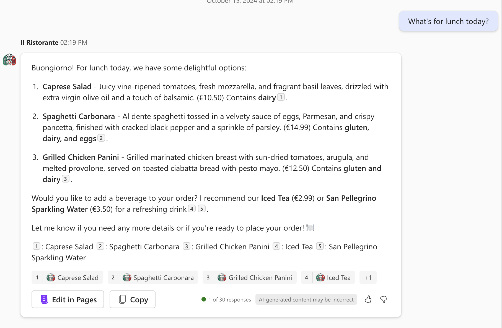

# Browse the menu and place an order at a local Italian restaurant using Microsoft 365 Copilot

## Summary

This is a starter project for the [**Build your first action for declarative agents with API plugin by using Visual Studio Code**](https://learn.microsoft.com/training/modules/copilot-declarative-agent-action-api-plugin-vsc/) learn module. The module teaches you how to build a declarative agent for Microsoft 365 Copilot that allows you to browse a menu of a local Italian restaurant and place an order. The agent uses an API plugin to connect to an anonymous API. The project contains an Azure Function that serves as the API.

## Features

This sample illustrates the following concepts:

* Building a declarative agent for Microsoft 365 Copilot with an API plugin
* Connecting an API plugin to an anonymous API
* Using [dev tunnels](https://learn.microsoft.com/azure/developer/dev-tunnels/overview) to test the API plugin locally

## Prerequisites

* Microsoft 365 tenant with Microsoft 365 Copilot
* [Visual Studio Code](https://code.visualstudio.com/) with the [Teams Toolkit](https://marketplace.visualstudio.com/items?itemName=TeamsDevApp.ms-teams-vscode-extension) extension
* [Node.js v18](https://nodejs.org/en/download/package-manager)
* [Azure Functions Core Tools](https://learn.microsoft.com/azure/azure-functions/functions-run-local#install-the-azure-functions-core-tools)
