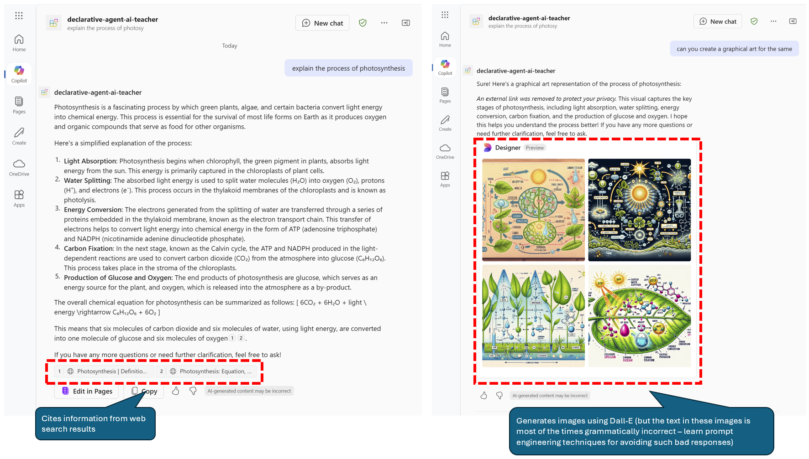

# Creating a simple declarative agent 

The agent that was created with this code and provisioned on an M365 copilot account using teams toolkit:
- Added `Conversation starters`

## Code interpretor
A simple questions for the code interpreter which also creates a graph using the python matplotlib library (the code is also given as part of the response):

## Web search and image generation capabilities
